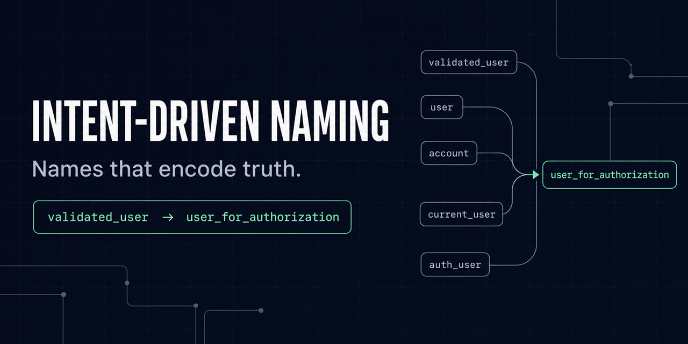

# Intent-Driven Naming

<p align="center">
  
</p>

<p align="center">
  A portable Agent Skill that helps AI coding agents name software from evidence while preserving behavior and contracts.
</p>

<p align="center">
  <a href="https://github.com/pabloamicodev/intent-driven-naming/actions/workflows/ci.yml"></a>
  <a href="LICENSE"></a>
  <a href="https://agentskills.io/specification"></a>
</p>

`intent-driven-naming` generates, audits, and safely refactors functions, parameters, local variables, types, fields, schemas, messages, queries, and infrastructure identifiers across languages and development stacks.

It is semantic guidance, not a blacklist. A script never rejects a name merely because it is called `data`, `result`, `item`, or `i`. A short or generic name is a successful `keep` decision when its meaning is already clear in context.

> **Project status:** the `2.0.0` package passes the checked-in offline validation suite. External cross-agent, held-out, human-reviewed evaluation is still required before claiming organization-grade effectiveness. See [Conformance and evidence](#conformance-and-evidence).

## The Problem It Solves

An identifier can compile, follow a style guide, and still mislead a maintainer about trust, state, units, ownership, side effects, or an external contract.

For example, assume repository evidence shows that the function receives a raw token, `parse_and_verify` returns verified claims, and `save` persists them:

**Before — every important role is hidden:**

```python
def process(data):
    result = parse_and_verify(data)
    return save(result)
```

**After — names expose the input, guarantee, and effect:**

```python
def persist_verified_claims(raw_token):
    verified_claims = parse_and_verify(raw_token)
    return save(verified_claims)
```

These are not universal word substitutions. The skill proposes a name only when declarations, types, data flow, callers, consumers, tests, vocabulary, and contracts support that meaning.

## Why It Is Different

- **Evidence before wording:** repository meaning outranks generic naming advice.
- **Contract-aware decisions:** public, serialized, generated, dynamic, persisted, and stateful names are treated as compatibility surfaces.
- **More than renaming:** the model can `keep`, `rename`, `map`, `migrate`, or `defer`.
- **Language-neutral core:** ecosystem profiles refine idiom without imposing one language's casing or programming model on another.
- **Context-efficient routing:** the agent loads the semantic core first and reads only the workflow, declaration, risk, and language guidance needed for the task.
- **Instruction-only runtime:** deterministic tools validate plans and evidence; they do not pretend to infer semantics from forbidden-word matching.

## Quick Start

Install with the [Agent Skills CLI](https://github.com/antfu/skills-cli), which reads `skills/intent-driven-naming/` directly from GitHub and installs only that directory into your agent's skills folder:

```shell
npx skills add pabloamicodev/intent-driven-naming
```

Or clone the repository and install only the runtime surface with the checked-in, hash-verified installer:

```shell
git clone https://github.com/pabloamicodev/intent-driven-naming.git
cd intent-driven-naming
python scripts/install_local_skill.py --destination "$HOME/.agents/skills/intent-driven-naming"
python scripts/install_local_skill.py --destination "$HOME/.agents/skills/intent-driven-naming" --check
```

The skill instructions have no runtime dependency. Python is required by the installer and by the optional dependency-free rename-plan validator. The installed surface contains only the skill instructions, routed references, portable schemas, and that validator.

### Installation Locations

Choose the path recognized by your host and desired scope:

| Scope | Host | Skill entrypoint |
|---|---|---|
| User | Agent Skills hosts and current Codex | `$HOME/.agents/skills/intent-driven-naming/SKILL.md` |
| User | Codex-specific installation | `$HOME/.codex/skills/intent-driven-naming/SKILL.md` |
| User | Claude | `$HOME/.claude/skills/intent-driven-naming/SKILL.md` |
| Repository | Agent Skills hosts and current Codex | `$REPOSITORY_ROOT/.agents/skills/intent-driven-naming/SKILL.md` |
| Repository | Claude | `$REPOSITORY_ROOT/.claude/skills/intent-driven-naming/SKILL.md` |

The installer refuses to overwrite an existing destination unless `--replace` is explicit. Replacement is atomic and retains a versioned backup outside the one-level discovery directory:

```shell
python scripts/install_local_skill.py --destination "$HOME/.agents/skills/intent-driven-naming" --replace
```

The package follows the portable [Agent Skills specification](https://agentskills.io/specification) and the progressive-disclosure models documented by [OpenAI](https://learn.chatgpt.com/docs/build-skills) and [Anthropic](https://platform.claude.com/docs/en/agents-and-tools/agent-skills/overview).

## Use

Generate new code with intent-revealing identifiers:

```text
$intent-driven-naming Implement a checkout service with clear names for requests, totals, payment state, and errors.
```

Run a read-only audit:

```text
$intent-driven-naming Audit identifiers in this module. Rank material findings and do not edit files.
```

Apply a safe refactor:

```text
$intent-driven-naming Rename dangerous or misleading identifiers without changing behavior or external contracts.
```

For a non-trivial change, ask the agent to emit a portable rename plan and validate it before editing:

```shell
python skills/intent-driven-naming/scripts/runtime/validate_rename_plan.py examples/rename-plan.json
```

Replace `examples/rename-plan.json` with the plan your agent emitted. See the [complete rename-plan example](examples/rename-plan.json) for the expected shape.

## Decision Model

| Outcome | Use |
|---|---|
| `keep` | The current name is clear, conventional, contract-bound, or not worth the churn. |
| `rename` | A supported internal rename creates material semantic gain. |
| `map` | Preserve an external spelling and expose a clearer internal alias. |
| `migrate` | Treat a public, persisted, dynamic, or stateful change as a coordinated migration. |
| `defer` | Available evidence cannot establish meaning or safety. |

Behavior regressions, silent contract changes, invented domain meaning, unauthorized audit mutations, and migrations disguised as refactors are non-compensable failures.

## Coverage

| Profile | Representative coverage |
|---|---|
| TypeScript and JavaScript | Node.js, browser modules, types, async APIs, serialization |
| Web frameworks | React, React Query, Vue, Svelte, Angular |
| Dynamic languages | Python, Ruby, PHP |
| Systems languages | Go, Rust, C, C++ |
| Managed and mobile | Java, Kotlin, C#, Swift, Dart |
| Functional and concurrent | Haskell, OCaml, F#, Scala, Clojure, Erlang, Elixir |
| Data and infrastructure | SQL, schemas, pipelines, shell, PowerShell, Terraform, Kubernetes |

Profiles are refinements, not an allowlist. Unlisted languages use the semantic model, repository evidence, compiler or analyzer feedback, and conservative contract safety. See [compatibility](docs/compatibility.md) for evidence-scoped support and [limitations](docs/limitations.md) for what is not yet proven.

## Progressive-Disclosure Architecture

```text
intent-driven-naming/
├── skills/intent-driven-naming/  the installable unit — nothing outside this loads at agent runtime
│   ├── SKILL.md                 small task and resource router
│   ├── agents/                  host-facing metadata
│   ├── references/              conditional semantic and language guidance
│   ├── scripts/runtime/         optional dependency-free plan validation
│   └── specification/           the two schemas the plan validator checks against
├── specification/        decisions, routes, and evidence policy for the rest of the repo
├── evals/                activation, behavior, and contract fixtures
├── harness/               provider-neutral experiment and review tooling
├── tests/                deterministic regression coverage
└── docs/                 operations, limitations, and governance
```

`SKILL.md` loads a small universal semantic core. Workflow, callable, local-variable, declaration, high-risk, boundary, and language guidance is conditional. Specifications, datasets, fixtures, and maintenance tooling remain outside normal task context. Everything an agent needs lives under `skills/intent-driven-naming/`, which is why `npx skills add` can install just that directory.

The checked-in `2.0.0` static comparison reports a 61.4% reduction in maximum standard-route words and a 70.4% reduction in total runtime-instruction words relative to `1.1.0`. These are deterministic context-size measures, not provider token measurements. See the [versioned evidence](benchmarks/2.0.0/evidence.md).

## Offline Validation

Install the pinned development dependencies and run every repository, schema, unit, dataset, plan, and fixture check:

```shell
python -m pip install -r requirements-dev.lock
python scripts/run_checks.py
```

The current offline suite contains:

- 84 balanced activation cases across seven locales.
- 52 behavior cases with 202 explicit invariants across six locales.
- 16 executable or contract-verifiable fixtures.
- Contract coverage for serialization, named arguments, dynamic lookup, generated sources, stateful resources, security trust stages, partial guarantees, shell behavior, Protobuf mapping, and telemetry.
- Deterministic runtime archives with a per-file manifest, SHA-256 checksums, and an SPDX 2.3 inventory.

Offline checks establish package, routing, schema, harness, and representative fixture integrity. They do not establish universal naming quality.

## Provider-Neutral Evaluation

Candidate and grader integrations communicate through JSONL rather than a vendor SDK. The evaluation system supports frozen experiment manifests, current-skill/no-skill/previous-skill cohorts, repeated pinned configurations, immutable results, blinded human review, pairwise comparison, uncertainty estimates, usage telemetry, and hard safety gates.

A development manifest can be validated without making an external model call:

```shell
python harness/run_experiment.py \
  --manifest examples/experiment-manifest.json \
  --runner-config examples/runner-config.json
```

External execution is always explicit because it may incur provider cost. Follow the [external evaluation operations](docs/external-evaluation.md), [benchmarking contract](benchmarks/README.md), [statistical protocol](docs/statistics.md), [data-handling policy](docs/data-handling.md), and [private evaluation protocol](docs/private-evaluation.md).

The design follows [OpenAI's evaluation best practices](https://developers.openai.com/api/docs/guides/evaluation-best-practices): task-specific cases, automated scoring where appropriate, continuous evaluation, typical and adversarial inputs, and human calibration.

## Conformance and Evidence

The project defines four cumulative evidence levels beyond package validity:

1. Routing and activation scope.
2. Semantic decisions.
3. Refactor and contract safety.
4. Held-out, human-calibrated, cross-agent evidence.

The repository currently establishes offline package and representative fixture evidence. Level 4 remains unclaimed until a preregistered experiment passes with public and private held-out suites, at least three pinned systems, three complete repetitions of each cohort, two independent human reviews per candidate and pair, complete telemetry, and every safety and quality gate.

Passing that study would support only the systems, versions, datasets, and conditions named in the experiment—not every language, repository, model, or future release.

See the [release policy](specification/release-policy.json), [conformance levels](specification/conformance-levels.md), [human evaluation protocol](docs/human-evaluation.md), and [limitations](docs/limitations.md).

## Documentation

| Topic | Document |
|---|---|
| Architecture | [docs/architecture.md](docs/architecture.md) |
| Compatibility and evidence-scoped support | [docs/compatibility.md](docs/compatibility.md) |
| Known limitations | [docs/limitations.md](docs/limitations.md) |
| External experiment operations | [docs/external-evaluation.md](docs/external-evaluation.md) |
| Human review | [docs/human-evaluation.md](docs/human-evaluation.md) |
| Statistics | [docs/statistics.md](docs/statistics.md) |
| Data handling and private suites | [docs/data-handling.md](docs/data-handling.md), [docs/private-evaluation.md](docs/private-evaluation.md) |
| Normative decision model | [specification/decision-model.md](specification/decision-model.md) |
| Versioned evidence | [benchmarks/README.md](benchmarks/README.md) |

## Contributing and Governance

Counterexamples, evaluation cases, language-specific corrections, safety failures, and reproducible benchmark results are especially valuable. Start with [Contributing](CONTRIBUTING.md).

- [Governance](GOVERNANCE.md)
- [Security policy](SECURITY.md)
- [Code of conduct](CODE_OF_CONDUCT.md)
- [Changelog](CHANGELOG.md)

Licensed under the [Apache License 2.0](LICENSE).
